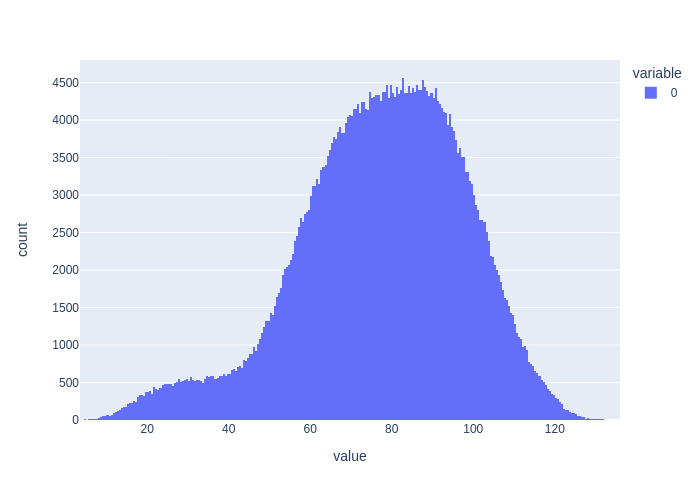
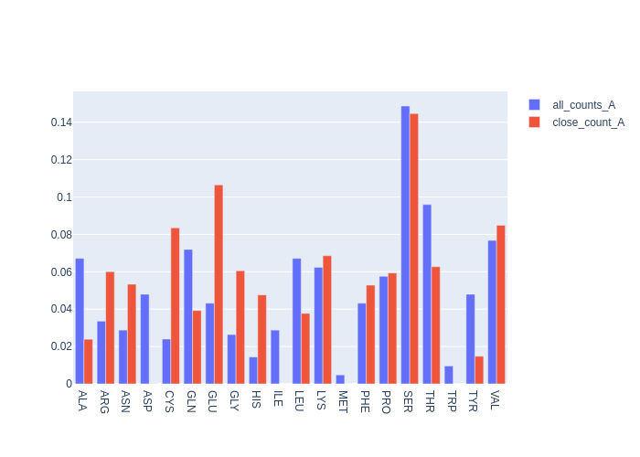
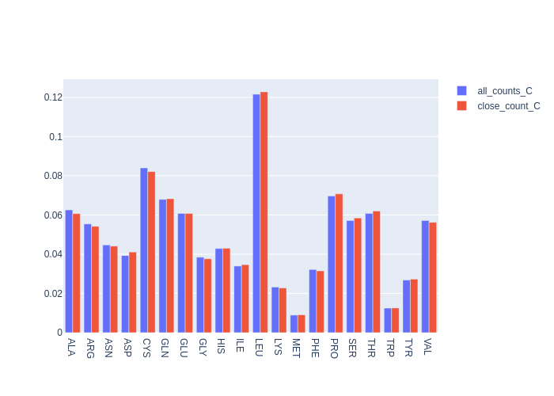

=====
Usage
=====

To use BioNumPy PDB in a project::

    pdb = bnp_pdb.PDB.from_file('1n8z.pdb')
    A, C = pdb.chains['A'], pdb.chains['C']
    A = A[(A.atom == 'CA') | (A.atom == 'CB')]
    C = C[(C.atom == 'CA') | (C.atom == 'CB')]
    table = bnp_pdb.distance_table(A, C)
    all_a_count = bnp.count_encoded(table.atom_a.residue)
    all_b_count = bnp.count_encoded(table.atom_b.residue)
    px.histogram(table.distance).show()

Only include pairs with < 30 A distance::

    table = table[table.distance < 30]
    close_a_count = bnp.count_encoded(table.atom_a.residue)
    close_b_count = bnp.count_encoded(table.atom_b.residue)

    def plot_bars(**counter_dict):
        fig = go.Figure()
        for name, counter in counter_dict.items():
            fig.add_trace(go.Bar(x=counter.alphabet,
                                 y=counter.proportions,
                                 name=name))
        return fig

    plot_bars(all_counts_A=all_a_count, close_count_A=close_a_count).show()

GLU and CYS residues are more common in in close pairs::

    plot_bars(all_counts_C=all_b_count, close_count_C=close_b_count).show()

Same distribution in close pairs as in all pairs

