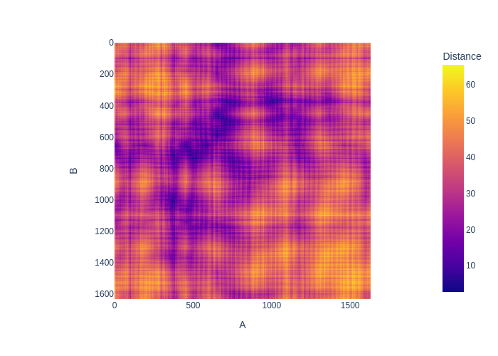

=====
Usage
=====

To use BioNumPy PDB in a project::

    import bnp_pdb
    from itertools import combinations
    import plotly.express as px

    pdb = bnp_pdb.PDB.from_file(filename)
    for chain_name_a, chain_name_b in combinations(pdb.chains.keys(), 2):
        matrix = bnp_pdb.distance_matrix(pdb.chains[chain_name_a],
	                                 pdb.chains[chain_name_b])
        labels = dict(x=chain_nam_a, y=chain_name_b, color="Distance")
        fig = px.imshow(matrix, labels).show()

